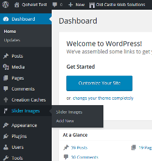
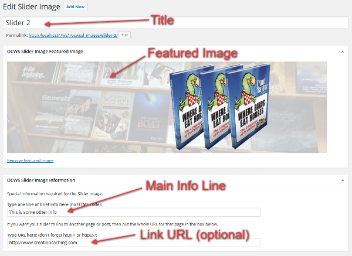
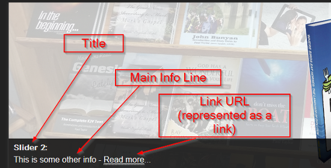
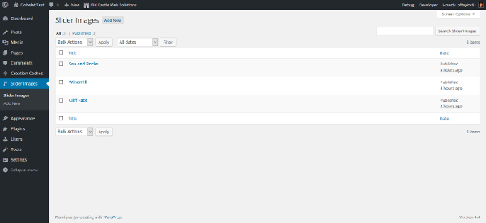

 

# ocws-slider
This plugin produces a jQuery powered slider.

## Current Version
The current version is 1.0.2.

## Implementation
The slider can be used in three ways.

1. PHP code can be "hard-wired" into any template, thus:

	<?php echo ocwssl_function(); ?>

2. A shortcode can be added to any page or post, to add the slider.

	[ocwssl-shortcode]

3. The slider can be added in a widget. The plugin installs the OCWS Slider Widget into the Widgets panel. The widget creates a much reduced slider.

Only one of the above implementations can be used.

## Slide Properties
The plugin has three types of slide properties - basically three sizes of images. The base sizes are actually expanded or contracted, because the slider is fully responsive to the media size in which it is displayed. The three sizes are:

1. Default (ocwssl_function). Width: 600; Height: 280.
2. Widget (ocwssl_widget). Width: 150; Height: 83.
3. Ultrathin (ocwssl_thin). Width: 600; Height: 75.

Note that the ultrathin version uses a different ratio of images. If using this size, it might be best to prepare the images in advance. If you do so, I recommend making the images 1200 x 150, and allowing the plugin to adjust the sizes responsively.

## Creating the Slides
This slideshow can display up to 5 slides. It does this, by implementing a new custom post type, called Slider Image. This can be seen on the left of the Admin Menu. Each Slider Image 'page' has only two parameters for you to worry about - the Title and the Featured Image (which is the image that will be displayed.

The Slider admin page has just these four features to adjust, before publishing.

The first job is to set the slide title. You should also have a brief comment (Main Info Line), to describe the slider, though this is optional. You can also add a Link URL. If you add a Link URL, then the system will add the words "Read more..." to the info line, and turn this into a link, that leads to the relevant page. These first three elements are deployed as shown below.

The fourth, but obviously the most important element, is to set the Featured Image, because this is the element that actually constitutes the picture for the slider. For this special custom post type ("Slider Image"), the featured image box has been moved, and the image made full size.

The list of Slider Images can also be seen here:

## Acknowledgements
As is common these days, with major Open Source projects, this plugin builds on a great legacy.

1. The javascript and jQuery code was produced by **Nivo** ([https://dev7studios.com/products/nivo-slider-wordpress-plugin/](https://dev7studios.com/products/nivo-slider-wordpress-plugin/ "Nivo"))
2. The structure of the plugin coding follows closely that of the Nivo Slider tutorial at **TutsPlus** [http://code.tutsplus.com/tutorials/build-a-slideshow-plugin-for-wordpress--wp-25789](http://code.tutsplus.com/tutorials/build-a-slideshow-plugin-for-wordpress--wp-25789 "TutsPlus")
3. Several other features have been cannibalized from my **OCWS Creation Cache** plugin.

## Further Development
Three features occur to me.

1. An options panel to determine the sizing of the Slider Images.
2. A method for implementing multiple sliders.
3. Micro-thumbnails of the Slider Images posted in the Admin Slider Image list.
4. A routine for choosing the order of slide display.

## Version 1.0.2
If the slide order is set to zero, this slide will not appear in the slideshow. Consequently, there is complete control over the show. So, the number of slides allowed has been increased to 10.

## Version 1.0.1
The menu order for the post type has now been introduced, so that the slideshow can be ordered by this menu order ascending. The menu order as been headed in the edit section as 'Slide Order'. It can be edited by Quick Edit.

## Version 0.9
A problem with the sizing of images was corrected.

## Version 0.8
The featured image box has been moved center stage in the admin panel, and the image made nearly full size. 

## Version 0.7
The plugin now features a simple info line, and an optional Link URL, providing a means for visitors to click from the slider to a featured page in the site, or off-site.

## Version 0.6
Some tweaks to the Javascript files.

## Version 0.5
Slider content added, to produce a better slider. This involved changing the js file, as well as the post-type declaration.

## Version 0.3.1
Some better instructions were added.

## Version 0.3
A new slider size, for ultra-thin banners, has been produced. This is especially useful with the Gold Bowl theme.

## Version 0.2
This is the current stable version. It is updateable, using the Github Updater plugin.
